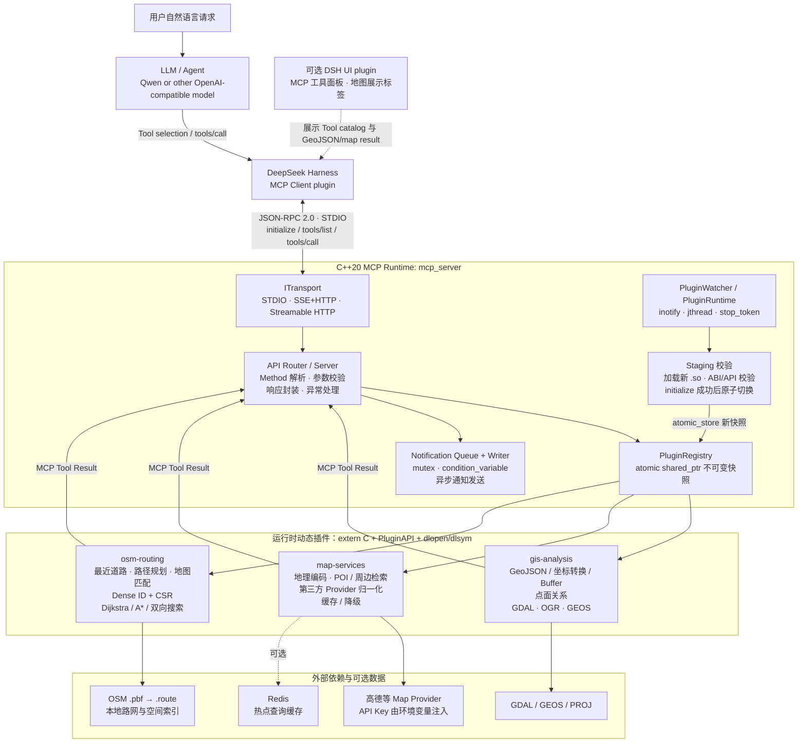
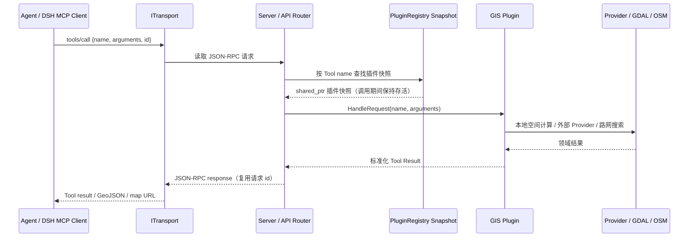
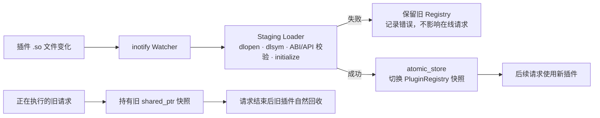

# C++ Plugin MCP Runtime for GIS/LBS

面向原生计算型 Tool 的 C++20 插件化 MCP Runtime，并以 GIS/LBS 服务验证完整链路：空间分析、地理编码、POI 检索、本地 OSM 路网查询、路径规划和地图匹配。

> 已发布的 DSH UI 插件：`@kaicmon/dsh-mcp-server-gis`。C++ Runtime 可通过
> GitHub Release 二进制包或源码构建使用；完整安装步骤见
> [发布版安装指南](packaging/RELEASE-README.md)。

## Why C++

本项目使用 C++ 是为了让 MCP Server 成为 GDAL/GEOS/PROJ、CSR 路网、A* 搜索等原生计算能力的长期运行宿主：

- C ABI `PluginAPI` + `dlopen/dlsym` 动态发现和加载插件；
- Staging 校验、原子 `shared_ptr` Registry 快照和延迟回收，支持插件能力无中断切换；
- `jthread/stop_token` 管理热更新监控、inotify Watcher 与通知 Writer 的协作停止；
- CSR 紧凑路网、`std::span` 零拷贝视图和 `std::pmr` 查询级内存资源，服务大规模本地路径搜索。

## Architecture



### 一次 Tool 调用的主链路



### 热更新与并发安全



面试时可以按这条主线讲：**Agent 只看到标准 MCP Tool Schema；C++ Runtime
负责协议、路由与生命周期；插件负责领域能力；Registry 快照将“热更新”与“在线
请求”隔离；GDAL/GEOS 与 CSR 路网把适合原生计算的 GIS 工作留在进程内完成。**

`integrations/deepseek-harness/` additionally provides an optional DSH renderer: an MCP Tool panel and a map tab for GeoJSON / externalized map results.

## GIS Tools

| Plugin | Examples |
| --- | --- |
| `gis-analysis` | `geometry_validate`, `coordinate_transform`, `geometry_buffer`, `features_within` |
| `map-services` | `geocode`, `poi_search`, `nearby_search`, `search_nearby_by_place`, `provider_route` |
| `osm-routing` | `route_plan`, `nearest_road`, `map_match` |

The default `gis-agent` Tool Profile exposes a curated subset. Provider keys, local datasets, and `.route` files are optional runtime inputs and are never included in source control or release configuration.

## Prerequisites

- Linux, CMake 3.20+, and a C++20 compiler;
- GDAL development package for GIS plugins;
- BZip2, Expat and Zlib development packages for OSM parsing;
- optional: an Amap key for online geocoding, POI and provider routing;
- optional: a generated local `.route` network for OSM routing and map matching.

On Ubuntu/Debian, the development packages normally include:

```bash
sudo apt-get install build-essential cmake pkg-config \
  libcurl4-openssl-dev libgdal-dev libbz2-dev libexpat1-dev zlib1g-dev
```

## Build

All generated files stay under `build_dev/`:

```bash
cmake -S . -B build_dev/gis-full-debug \
  -DCMAKE_BUILD_TYPE=Debug \
  -DBUILD_GIS=ON \
  -DBUILD_ROUTING=ON \
  -DBUILD_TESTING=ON
cmake --build build_dev/gis-full-debug -j2
ctest --test-dir build_dev/gis-full-debug --output-on-failure
```

## Local installation

The local installer uses CMake install rules and needs no root access:

```bash
bash packaging/install-local.sh --prefix "$HOME/.local"
```

It installs:

```text
~/.local/
  bin/mcp_server
  lib/mcp-server-gis/plugins/{gis-analysis,map-services,osm-routing}/*.so
  share/mcp-server-gis/config/tool-profiles.json
  share/mcp-server-gis/dsh/gis-mcp.cordis.patch.example.yml
```

## Run through STDIO

```bash
export AMAP_API_KEY='...'                     # optional, online Provider only
export MCP_ROUTING_NETWORK='/path/city.route' # optional, local routing only

~/.local/bin/mcp_server \
  --plugins ~/.local/lib/mcp-server-gis/plugins \
  --tool-profile gis-agent \
  --tool-profiles-file ~/.local/share/mcp-server-gis/config/tool-profiles.json
```

The server reads JSON-RPC messages from stdin and writes responses to stdout. See `packaging/dsh/gis-mcp.cordis.patch.example.yml` for the corresponding official `@deepseek-ai/dsh-mcp-client` STDIO configuration.

## DeepSeek Harness integration

For repository development, build the local DSH components and start Web:

```bash
bash integrations/deepseek-harness/build-renderer.sh
bash integrations/deepseek-harness/build-control-plane.sh
bash integrations/deepseek-harness/build-rag-bridge.sh
bash integrations/deepseek-harness/run-web.sh
```

The current RAG Bridge is observe-only: it records the Tool catalog and schema Token baseline without changing model-visible schemas. Dynamic Tool filtering will be enabled only after recall and task-success A/B evaluation.

## Documentation

- [Plugin development](docs/mcp-plugin-development.md)
- [Plugin hot-update design](docs/plugin-hot-reload-design.md)
- [OSM routing plugin plan](docs/osm-routing-mcp-plugin-plan.md)
- [GIS/LBS implementation status](docs/gis-lbs-implementation-status.md)
- [Modern C++ runtime upgrades](docs/modern-cpp-runtime-roadmap.md)
- [Open-source release plan](docs/open-source-release-plan.md)
- [Release installation guide](packaging/RELEASE-README.md)

## Security notes

- Never commit map-provider keys, model keys, database URLs, or user datasets.
- Treat external Tool input as untrusted; configure timeouts and output limits.
- Enable plugin hot reload only for a controlled plugin directory.
- The repository is licensed under [MIT](LICENSE); see [NOTICE](NOTICE) for
  retained third-party notices and binary-distribution obligations.
