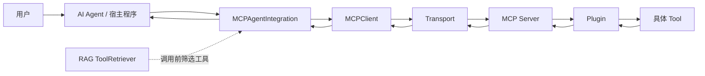
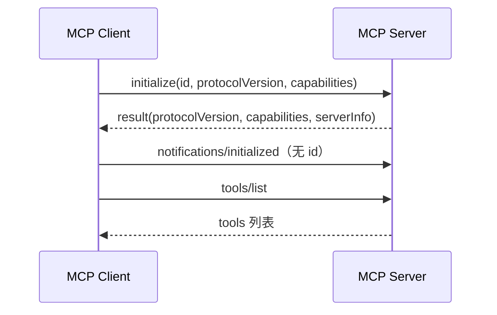
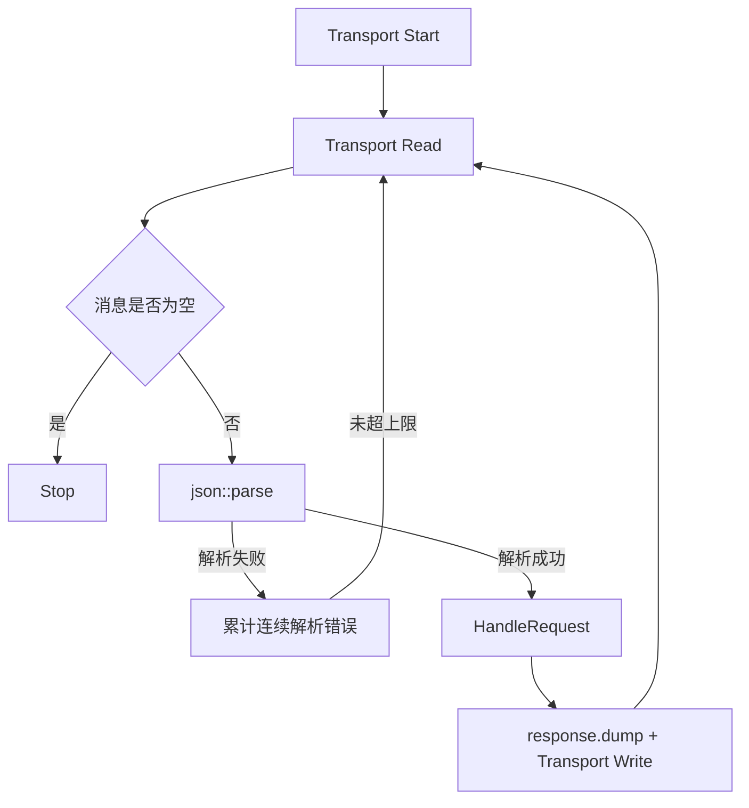
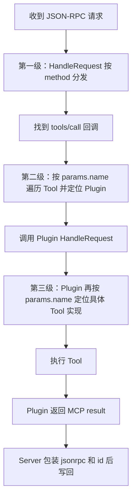

# 第一天：项目全景与主调用链

## 本日目标

建立 MCP 项目的整体认识，理解 Client、Server、Transport、Plugin、Tool 和 RAG 的职责，并走通一次 `tools/call` 请求的完整路径。

## 一、项目解决的问题

大模型通常不能直接调用本地 C++ 函数。MCP 在 AI 应用与外部能力之间建立统一协议，使 Client 能够发现和调用 Server 提供的工具、资源及提示模板。

本项目不仅实现 MCP Server，也提供 MCP Client 和 RAG 工具检索模块：



## 二、核心组件职责

### 1. 宿主程序

`mcp_client` 被构建为静态库，本身没有固定的 `main()`。真正的入口属于使用该库的宿主程序，例如 `examples/rag_mcp_example.cpp`。

宿主程序负责：

- 创建 `MCPClient` 或 `MCPAgentIntegration`
- 决定何时发现和调用工具
- 处理工具调用结果

因此要区分：

- 业务发起者：宿主程序或 AI Agent
- 协议发送者：`MCPClient`

### 2. MCPClient

`MCPClient` 是底层协议客户端，负责连接、构造 JSON-RPC 请求、通过 STDIO/SSE 发送消息及解析响应。

典型请求路径：

```text
宿主调用 callTool()
  → MCPClient::callTool()
  → MCPClient::sendRequest()
  → sendRequestStdio() 或 sendRequestSSE()
```

### 3. MCPAgentIntegration

它是面向 Agent 的高层封装，可以概括为：

```text
MCPAgentIntegration
  = MCPClient
  + 工具管理
  + 错误与降级处理
  + Agent 格式适配
  + 可选 RAG 检索
```

### 4. Transport

Transport 负责搬运字符串，不理解 `calculator`、参数或插件。

- STDIO：通过子进程标准输入输出通信
- SSE：通过 HTTP/SSE 通信
- HttpStream：存在实现文件，但当前服务端入口没有对应启动选项

`Server` 只依赖 `ITransport::Read()` 和 `Write()`，因此不需要知道底层传输类型。

### 5. Server

Server 负责：

- 启动 Transport
- 读取并解析 JSON
- 根据 JSON-RPC `method` 分发请求
- 写回响应
- 管理异步通知输出

### 6. Plugin 与 Tool

Plugin 是动态库和功能容器；Tool 是 Plugin 对外声明的一项具体能力。

一个 Plugin 可以拥有多个 Tool：

```text
Calculator Plugin
  ├── calculator
  ├── add
  ├── subtract
  ├── multiply
  ├── divide
  ├── power
  ├── sqrt
  └── factorial
```

插件使用 `GetToolCount()` 和 `GetTool(index)` 暴露其 Tool 列表，对所有内部工具共用一个 `HandleRequest()` 入口。

## 三、JSON-RPC 基础

### 请求

```json
{
  "jsonrpc": "2.0",
  "id": "call-1",
  "method": "tools/call",
  "params": {
    "name": "add",
    "arguments": {"a": 1, "b": 2}
  }
}
```

- `jsonrpc`：协议版本
- `id`：关联请求与响应
- `method`：MCP 方法
- `params`：方法参数

### 成功响应

```json
{
  "jsonrpc": "2.0",
  "id": "call-1",
  "result": {
    "content": [{"type": "text", "text": "1 + 2 = 3"}],
    "isError": false
  }
}
```

### 两类错误

```text
JSON-RPC error 字段
  → 请求格式、method 分发等协议层错误

result.isError = true
  → 已成功进入 MCP 方法，但 Tool 查找或执行失败
```

例如：

- 缺少 `method`：JSON-RPC Invalid Request
- 不存在的 JSON-RPC 方法：JSON-RPC Method Not Found
- `tools/call` 找不到工具：MCP Tool 层错误
- `divide` 的除数为零：Tool 执行错误

### Notification

Notification 通常没有 `id`，发送方不等待普通响应：

```json
{
  "jsonrpc": "2.0",
  "method": "notifications/initialized",
  "params": {}
}
```

## 四、初始化握手

规范流程为：



当前源码有两个需要注意的地方：

1. Server 直接回显 Client 提交的 `protocolVersion`，没有真正验证或协商版本。
2. C++ `MCPClient::connect()` 启动连接后没有主动发送 `initialize`，会直接进入 `tools/list` 等调用，初始化流程不完整。

## 五、Server 主循环

`Server::Connect()` 的核心流程：



解析成功后 `parserErrors_` 会清零，所以限制的是连续解析错误，而不是累计错误总数。

普通响应由请求循环直接写回；插件异步通知进入队列，由 `WriterLoop` 写出。两条路径共用 `output_mutex_`，防止两个 JSON 字符串交错写入。

## 六、工具发现：tools/list

`main.cpp` 使用 `OverrideCallback()` 替换 Server 默认的 `tools/list` 实现，然后：

1. 遍历所有已加载 Plugin。
2. 筛选 `PLUGIN_TYPE_TOOLS`。
3. 遍历 Plugin 的所有 Tool。
4. 汇总 `name`、`description` 和 `inputSchema`。

`inputSchema` 描述 Tool 需要的字段、类型和必填项。它能指导 Client 和大模型构造参数，但当前 Server 没有在统一入口执行完整的 JSON Schema 验证。

## 七、工具调用：tools/call

一次工具调用存在三级分发：



必须记住三个边界：

1. `Server::HandleRequest()` 只负责找到 `tools/call` 方法处理函数。
2. `main.cpp` 的回调根据工具名找到声明该工具的 Plugin。
3. Plugin 的 `HandleRequest()` 再根据工具名调用内部实现。

请求中没有插件名。Server 通过 Tool 列表反向找到 Plugin。

## 八、完整示例：divide(10, 0)

```text
method = tools/call
  → Server 找到 tools/call 回调
params.name = divide
  → 回调找到 Calculator Plugin
Calculator HandleRequest
  → 找到 divide 实现
b = 0
  → 抛出 Division by zero
Plugin 捕获异常
  → content 写入错误文本，isError=true
```

但当前 `main.cpp` 在解析插件结果后无条件执行：

```cpp
response["result"]["isError"] = false;
```

所以最终响应可能同时包含错误文本和 `isError=false`。这是明确的实现缺陷：Server 应保留插件返回的错误状态，只在字段缺失时补默认值。

## 九、当前发现的设计风险

### 1. 请求 ID 可能碰撞

Client 使用秒级时间戳生成请求 ID。同一秒内的多个请求可能拥有相同 ID，导致响应无法可靠关联到原请求。

### 2. 工具名称冲突

当前调用采用线性遍历，遇到第一个同名 Tool 后立即执行；`tools/list` 却可能返回多个同名 Tool。项目没有唯一性检查或插件命名空间。

### 3. 工具查找效率

每次调用都遍历全部 Plugin 和 Tool。工具规模较大时，可在加载阶段建立：

```cpp
std::unordered_map<std::string, PluginAPI*> toolRegistry;
```

### 4. 初始化不完整

C++ Client 未自动执行规范的 `initialize → notifications/initialized` 流程。

### 5. 错误状态被覆盖

Server 无条件把插件的 `isError` 改为 `false`，可能掩盖 Tool 执行失败。

## 十、本日结论

这个项目的主链路可以压缩成一句话：

> 宿主程序通过 MCPClient 发送 JSON-RPC 请求，Server 按 `method` 分发到 MCP 回调，再按工具名找到 Plugin，由 Plugin 内部执行具体 Tool，最后将结果沿 Transport 返回。

第一天学习完成后，应能独立解释：

- Client 请求由谁发起
- Plugin 与 Tool 的一对多关系
- JSON-RPC 与 MCP 的区别
- Request 与 Notification 的区别
- `initialize` 的作用
- `tools/list` 和 `tools/call` 的职责
- 工具调用的三级分发
- 当前源码中的主要流程缺陷

## 源码索引

- `mcp_client/src/mcp_client.cpp`
- `mcp_client/include/agent_rpc/mcp/mcp_client.h`
- `mcp_client/include/agent_rpc/mcp/mcp_agent_integration.h`
- `mcp_server/src/main.cpp`
- `mcp_server/src/server/Server.cpp`
- `mcp_server/src/interface/ITransport.h`
- `mcp_server/src/interface/PluginAPI.h`
- `mcp_server/src/loader/PluginsLoader.cpp`
- `mcp_server/plugins/calculator/Calculator.cpp`

