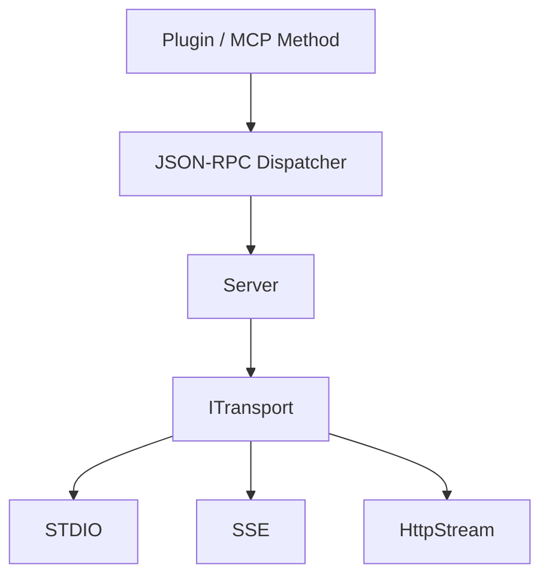

# 第三天：Transport 传输层

## 学习目标

理解 `ITransport` 如何隔离 MCP Server 与具体通信方式，掌握 STDIO、SSE 和 HttpStream 的消息路径、分帧方式、生命周期及当前实现状态。

## 一、ITransport 的职责

`ITransport` 向 `Server` 提供统一接口：

```cpp
Start();
Stop();
IsRunning();
Read();
Write();
ReadAsync();
WriteAsync();
```

分层边界：



Transport 负责：

- 启动和停止底层通信设施
- 找到每条消息的边界
- 向 Server 返回完整消息
- 将 Server 产生的消息写回对端

Transport 不负责：

- 解释 JSON-RPC `method`
- 查找 Plugin 或 Tool
- 执行业务逻辑
- 判断 MCP 结果语义

## 二、Read 的隐式契约

接口定义：

```cpp
std::pair<size_t, std::string> Read();
```

Server 实际假设：

```text
{length > 0, message}
  → 一条完整 JSON-RPC 消息

{0, ""}
  → Transport 永久结束，Server 应停止
```

这个类型无法明确区分：

- 正常 EOF
- 本地主动停止
- 空消息
- I/O 错误
- 临时没有数据

更清晰的接口应返回结构化状态：

```cpp
enum class ReadStatus {
    Message,
    EndOfStream,
    Stopped,
    Error
};

struct ReadResult {
    ReadStatus status;
    std::string message;
    std::string error;
};
```

## 三、STDIO Transport

### 3.1 双管道模型

POSIX 匿名管道是单向的，所以 Client 创建两条：


子进程通过 `dup2()` 将管道连接到：

```text
fd 0 / stdin  ← Client→Server 管道
fd 1 / stdout → Server→Client 管道
```

随后 `execv()` 将子进程替换为 MCP Server，文件描述符连接继续保留。

### 3.2 消息分帧

STDIO 使用换行符区分消息：

```text
紧凑 JSON + \n
```

Server 逐字符读取，遇到 `\n` 返回一条消息。Client 使用缓冲区，能够处理：

- 一次 `read()` 只得到半条消息
- 一次 `read()` 得到多条消息
- 完整消息后附带下一条的部分内容

格式化的多行 JSON 不适用于当前实现。

### 3.3 stdout 是协议通道

Server stdout 只能写 JSON-RPC 消息：

```text
stdout → 协议
stderr → 诊断日志
文件   → 持久化日志
```

任何普通日志写入 stdout 都会被 Client 当成 JSON 解析，造成协议污染、响应超时或关联错误。

### 3.4 EOF 与停止

当管道所有写端关闭后：

```text
POSIX read() == 0
std::getc(stdin) == EOF
```

表示字节流永久结束。

当前 Server 的逐行读取会把“空行”和“EOF”都转换成 `{0, ""}`，因此一个空行也可能让 Server 停止。

### 3.5 当前缺陷

- Client 的非阻塞读取在 `EAGAIN` 后立即重试，可能形成忙循环。
- Client 单次调用 `write()`，没有处理部分写入和 `EINTR`。
- `Stdio::Stop()` 是空函数，不能主动解除另一个线程的阻塞读取。
- `execv()` 失败后的公共 Logger 写 stdout，可能污染协议通道。
- 固定等待 100ms 不能证明子进程启动成功。

## 四、SSE Transport

### 4.1 双向通信模型

SSE 本身只承担 Server→Client 持续事件流；Client→Server 使用独立 HTTP POST：


### 4.2 输入路径

```text
HTTP POST Handler
  → incoming_messages_
  → incoming_cv_ 唤醒
  → SSE::Read()
  → Server::HandleRequest()
```

`incoming_messages_` 的生产者是 HTTP POST Handler，消费者是 Server 请求线程。

### 4.3 输出路径

```text
Server::Write()
  → outgoing_messages_
  → SSE Content Provider
  → data: JSON\n\n
  → Client
```

`outgoing_messages_` 的生产者是 Server，消费者是 SSE 内容提供器。

普通 Response 和 Notification 都通过同一 SSE 流返回。

### 4.4 POST 确认与 MCP Response

POST 返回：

```json
{"status":"received"}
```

只表示 HTTP Handler 已将请求放入输入队列，不是 MCP 最终响应。真正 JSON-RPC Response 随后从已经存在的 `/sse` 长连接返回。

### 4.5 Session

GET 和 POST 是两条独立连接，需要 Session ID 关联：

```text
POST 请求
  → 属于哪个 SSE Client
  → Response 应发送到哪条 SSE 流
```

完整实现需要：

```text
session_id → connection / queues / state
```

当前实现只有全局队列和布尔状态，没有按 Session 保存连接及队列，因而不能可靠支持多个 Client。

### 4.6 Keep-alive

```text
: ping
```

是 SSE 注释和传输层保活信息，MCP Client 不应把它当业务消息。

```text
notifications/progress
```

则是 SSE `data` 中承载的 JSON-RPC/MCP 应用通知。

### 4.7 Client/Server 不一致

```text
Server：POST /messages?session_id=...
Client：POST /message?sessionId=...
```

存在：

- `/messages` 与 `/message` 不一致
- `session_id` 与 `sessionId` 不一致
- Client 没有正确解析 `event: endpoint`
- Client 可能把 POST 接收确认误当 MCP Response
- 带总超时的 `curl_easy_perform()` 不适合建立永不主动结束的 SSE 流

因此 Server 虽有主要 SSE 结构，当前 C++ Client 与其不能形成可靠闭环。

## 五、HttpStreamTransport

### 5.1 设计意图

从源码可推断它希望使用统一 endpoint：

```text
POST   /mcp → MCP 请求
DELETE /mcp → 结束 Session
Mcp-Session-Id Header → Session 关联
```

与旧式 SSE 相比，它试图把通信集中到 `/mcp`，并用 Header 管理 Session。

### 5.2 当前不可运行

它只是未完成骨架：

- `server_` 没有初始化，构造时 `SetupRoutes()` 会解引用空指针。
- `Read()` 固定返回 `{0, ""}`，Server 会立即停止。
- `Write()` 是空函数，响应会丢失。
- `ReadAsync()`、`WriteAsync()` 没有返回值。
- POST 和 DELETE Handler 都为空。
- CORS 函数已定义但没有接入 Handler 或 OPTIONS 路由。
- 没有 Client 实现和自动测试。
- `main.cpp` 没有 HttpStream 启动选项。

加入 CMake 只代表参与编译，不代表功能可用。

### 5.3 ITransport 模型的不适配

当前接口使用全局：

```text
Read → HandleRequest → Write
```

普通 HTTP 更自然的模型是：

```text
HTTP Handler 收到 Request
  → 调用 JSON-RPC Dispatcher
  → 直接填写对应 HTTP Response
```

要完成 HttpStream，可以：

1. 建立请求/响应队列及关联上下文；或
2. 将 JSON-RPC Dispatcher 从 `Server` 中提取出来，让 HTTP Handler 直接调用。

第二种结构通常更清晰。

## 六、三种 Transport 统一比较

| 维度 | STDIO | SSE | HttpStream 当前状态 |
| --- | --- | --- | --- |
| 典型场景 | 本地子进程 | 远程持续事件流 | 统一 HTTP endpoint |
| Client→Server | stdin 管道 | HTTP POST | 计划为 POST `/mcp` |
| Server→Client | stdout 管道 | SSE GET 长连接 | 计划为 HTTP/流式响应 |
| 消息边界 | 单行末尾 `\n` | SSE 事件末尾 `\n\n` | 尚未实现 |
| 生命周期 | 子进程和管道 | HTTP Server 与长连接 | 只有启动骨架 |
| Session | 进程连接隐含关联 | 应显式关联 GET/POST | 计划使用 Header |
| 多 Client | 通常单 Client | 理论可支持，当前未隔离 | 未实现 |
| Keep-alive | 通常不需要 | `: ping` | 未实现 |
| 普通响应 | stdout | SSE stream | 未实现 |
| Notification | stdout | SSE stream | 未实现 |
| 停止信号 | EOF/进程退出 | Server stop/连接断开 | 未实现完整语义 |
| 项目完成度 | 主链路基本完整 | Server 有结构但两端不一致 | 不可运行骨架 |

## 七、生命周期与停止统一比较

### STDIO

```text
Start：无额外工作
Running：阻塞读取 stdin
Stop：当前为空
结束：依赖 EOF 或进程信号
```

### SSE

```text
Start：创建 HTTP listen 线程
Running：HTTP Handler + incoming/outgoing queues + SSE stream
Stop：关闭运行标志、停止 HTTP Server、join 线程、唤醒条件变量
结束：Server stop、SSE 写失败或连接失活
```

### HttpStream

```text
Start：有 listen 线程骨架
Running：请求处理尚未实现
Stop：有基本 HTTP Server 停止代码
结束：无法形成完整运行状态
```

统一停止原则应是：

```text
阻止新请求
  → 解除阻塞 Read
  → 决定是否排空队列
  → 停止底层连接或进程
  → 唤醒等待线程
  → join 所有线程
  → 释放 Session 和队列资源
```

## 八、错误处理统一比较

Transport 应区分：

```text
临时无数据
对端正常关闭
本地主动停止
协议分帧错误
I/O 错误
超时
认证或 HTTP 状态错误
```

当前统一返回值 `{size_t, string}` 无法表达这些状态，导致：

- STDIO 空行与 EOF 混淆
- SSE 停止和无消息依赖额外布尔变量解释
- HttpStream 无法表达 HTTP Request/Response 上下文

Transport 错误与 JSON-RPC 错误也应分开：

```text
Transport Error
  → 消息没有可靠送达或连接失败

JSON-RPC Error
  → 消息已送达，但请求结构或方法有问题

MCP Tool Error
  → 已进入具体 Tool，业务执行失败
```

## 九、阶段结论

1. `ITransport` 成功隔离了 Server 与具体通信方式，但接口的状态和请求上下文表达不足。
2. STDIO 是当前最接近完整的本地通信链路，核心约定是双管道和单行 JSON。
3. SSE 使用 POST 输入和 SSE 流输出，核心难点是 Session、事件解析及两端一致性。
4. HttpStream 尚未形成可运行实现，也暴露了全局 `Read/Write` 接口对普通 HTTP request-response 模型的不适配。
5. 判断 Transport 是否可用，不能只看类、路由或 CMake，而要验证启动、双向读写、停止、错误和测试闭环。

## 源码索引

- `mcp_server/src/interface/ITransport.h`
- `mcp_server/src/transport/StdioTransport.h`
- `mcp_server/src/transport/StdioTransport.cpp`
- `mcp_server/src/transport/SseTransport.h`
- `mcp_server/src/transport/SseTransport.cpp`
- `mcp_server/src/transport/HttpStreamTransport.hpp`
- `mcp_server/src/transport/HttpStreamTransport.cpp`
- `mcp_client/src/mcp_client.cpp`
- `mcp_server/src/main.cpp`

