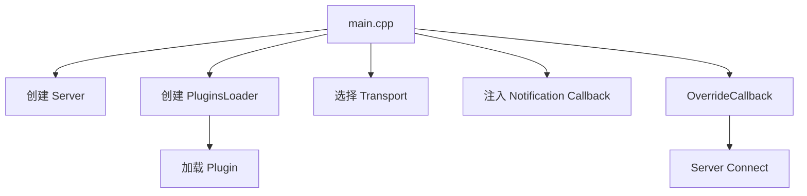
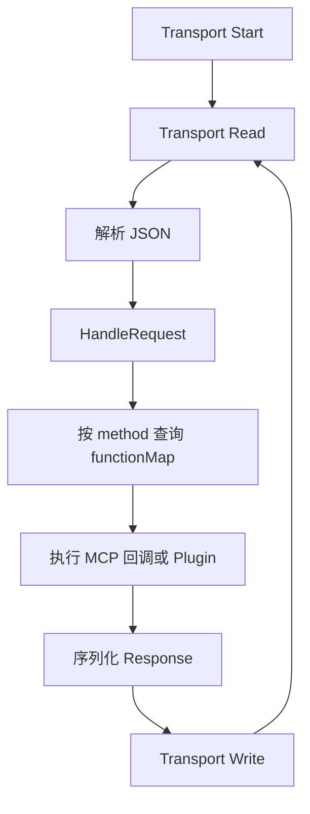
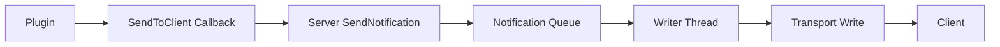
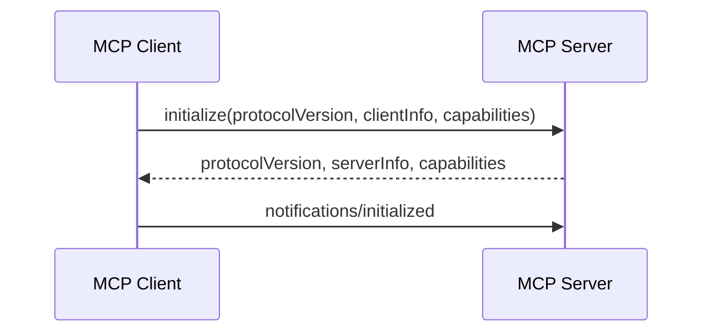

# 第二天：协议与服务端核心

## 学习目标

理解 MCP Server 如何注册和分发方法、管理 Transport、处理普通响应与异步通知，并认识当前实现的主要边界。

## 一、Server 在项目中的位置

`main.cpp` 是依赖组装入口：



职责边界：

- `Server`：协议路由、请求循环、响应和通知输出。
- `PluginsLoader`：加载及卸载动态插件。
- `main.cpp`：把 Transport、Server 和插件系统连接起来。
- Plugin：执行具体 Tool、Prompt 或 Resource 行为。

## 二、方法注册与覆盖

`Server` 构造时在 `functionMap` 注册默认方法：

```text
initialize       → InitializeCmd
ping             → PingCmd
tools/list       → ToolsListCmd
tools/call       → ToolsCallCmd
resources/list   → ResourcesListCmd
prompts/list     → PromptsListCmd
```

默认 Tool 方法只提供空列表或未实现结果。`main.cpp` 使用 `OverrideCallback()` 把它们替换为插件实现。

```text
Server.cpp：定义通用 MCP 路由
main.cpp：注入插件相关业务
```

`OverrideCallback()` 只能替换 `functionMap` 中已有的方法，不能注册任意新方法。

## 三、Server 请求主循环

同步 `Connect()` 的核心过程：



同步模式下，调用 `Connect()` 的 main 线程负责：

```text
Read → HandleRequest → Plugin HandleRequest → 普通响应 Write
```

耗时 Tool 会阻塞该线程，后续普通请求只能等待。

## 四、Notification 线程模型

Plugin 不直接依赖 `Server`，而是通过 `NotificationSystem` 中的函数指针发送通知：



Writer 线程只处理异步 Notification，不执行 Tool，也不写普通 Tool 响应。

`progress_test` 即使能持续发送进度，其 Tool 本身仍在请求线程同步执行：

```text
main/Reader：执行 Tool 约 10 秒
Writer：期间发送 10%、20%……进度通知
main/Reader：Tool 完成后写最终响应
```

`progressToken` 关联长任务的一系列进度通知；JSON-RPC `id` 关联请求与最终响应。

## 五、Connect 与 ConnectAsync

| 项目 | `Connect()` | `ConnectAsync()` |
| --- | --- | --- |
| 请求线程 | 调用线程 | Reader 线程 |
| 是否立即返回 | 否 | 是 |
| 请求执行 | 串行 | 仍然串行 |
| Writer 线程 | Notification | Notification |
| 多 Tool 并发 | 不支持 | 不支持 |

`ConnectAsync()` 只是把串行请求循环搬到 Reader 线程，不等于多个请求并发。

当前实现还有两个明显问题：

- Reader 调用 `ReadAsync()` 后立即 `future.get()`，中间没有并行工作。
- `ConnectAsync()` 没有调用 `Transport::Start()`，对 SSE 等 Transport 会造成实际启动缺失。

真正的并发处理至少需要：

```text
Reader → Request Queue → Worker Pool → Output Queue → Writer
```

同时还要解决插件线程安全、取消、Session 隔离和响应关联。

## 六、停止与资源回收

停止流程的核心思想：

```text
设置停止状态
  → 停止 Transport，解除阻塞读取
  → 修改 Writer 退出标志
  → 条件变量唤醒 Writer
  → join Writer
  → join 可选 Reader
```

关键概念：

- 修改退出变量不会自动唤醒正在 `wait()` 或阻塞 `Read()` 的线程。
- `joinable()` 不表示线程函数仍在运行，只表示线程对象尚未 `join()` 或 `detach()`。
- 析构函数调用 `Stop()` 是 RAII 兜底。

当前实现的风险包括：

- `isStopping_` 不是原子变量。
- STDIO 的 `Stop()` 不能解除 `std::getc(stdin)` 阻塞。
- 信号处理函数直接执行日志、智能指针和 `join()` 等非信号安全操作。
- 多线程同时调用 `Stop()` 缺少完整保护。

## 七、JSON-RPC 错误模型

```text
-32700 Parse Error       JSON 无法解析
-32600 Invalid Request   JSON 合法，但不是有效请求
-32601 Method Not Found  method 未注册
-32602 Invalid Params    方法存在，但参数不合法
-32603 Internal Error    Server 内部失败
```

必须区分：

```text
JSON-RPC error
  → 请求没有正常完成协议方法处理

MCP result.isError
  → tools/call 已进入具体 Tool，但 Tool 执行失败
```

当前实现存在以下缺口：

- JSON 解析失败只写日志，没有返回 `ParseError`。
- `InvalidParams` 和 `InternalError` 缺少系统接入。
- 错误构造器强制把 ID 当作字符串，不能可靠保留原 ID 类型。
- 方法不存在时先把 ID 转成 `int`，字符串 ID 可能触发异常。
- Server 无条件把插件结果的 `isError` 覆盖为 `false`。

## 八、初始化与能力声明

初始化交换：



能力与内容需要分开理解：

```text
capabilities.tools
  → Server 支持 Tools 功能类别

tools/list
  → 当前具体存在的 Tool
```

当前 Server 静态声明 Tools、Prompts、Resources Subscribe 和 Logging，未根据运行时实现动态判断。`resources.subscribe=true` 等声明也超过了实际完整行为。

Server 直接回显 Client 的 `protocolVersion`，没有进行真正的版本验证或兼容协商。

初始化代码读取的 `workspace`、`textDocument` 和 `completionItem` 字段未影响 MCP 后续行为，属于可疑的遗留代码。

## 九、阶段结论

一条普通请求的服务端主链路是：

```text
Transport Read
  → JSON Parse
  → Server HandleRequest
  → functionMap 按 method 分发
  → main.cpp 覆盖回调
  → Plugin HandleRequest
  → 普通响应 Write
```

通知链路是：

```text
Plugin Callback
  → Server SendNotification
  → Notification Queue
  → Writer Thread
  → Transport Write
```

阶段二的核心不是记住全部方法，而是掌握三个边界：

1. Server 协议路由与插件业务实现解耦。
2. 普通请求串行执行，Writer 只负责 Notification。
3. 能力声明、接口存在和实际完整行为是三个不同层次。

## 源码索引

- `mcp_server/src/main.cpp`
- `mcp_server/src/server/Server.h`
- `mcp_server/src/server/Server.cpp`
- `mcp_server/src/utils/MCPBuilder.h`
- `mcp_server/src/interface/PluginAPI.h`
- `mcp_server/plugins/notification/Notification.cpp`

