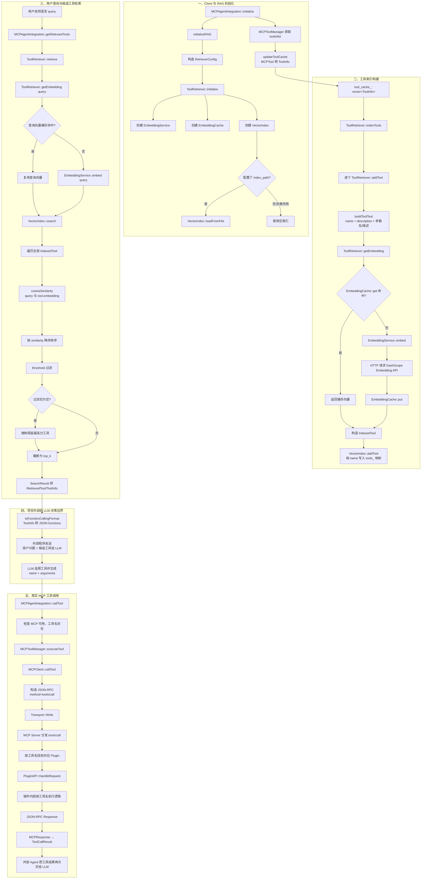

# 第五天：RAG-MCP 工具检索

## 学习目标

理解项目如何把 MCP 工具转换成向量索引，根据用户问题检索 Top-K 候选工具，并把候选工具交给外部 LLM；同时明确 RAG 检索、LLM 决策和 MCP 工具执行三者的边界。

## 一、RAG-MCP 解决的问题

不使用 RAG 时，Agent 通常把所有工具定义都发送给 LLM。工具数量增大后，会增加上下文长度、模型成本和选错工具的概率。

本项目先把工具的名称、描述和参数信息转换成向量。收到用户问题后，只检索语义最相关的少量工具，再把这些候选工具交给 LLM。

```text
全部 MCP 工具 ──建立索引──> 工具向量库
                              ▲
用户问题 ──生成查询向量───────┘
                              │ 相似度搜索
                              ▼
                         Top-K 候选工具
```

RAG 只负责缩小候选范围，最终选择哪个工具以及生成什么参数，仍应由 LLM 决定。

## 二、核心组件

| 组件 | 职责 | 主要源码 |
| --- | --- | --- |
| `EmbeddingService` | 调用外部 Embedding API，把文本转换为向量 | [embedding_service.cpp](/home/humr/agan-projects/mcp/mcp_client/src/rag/embedding_service.cpp:1) |
| `EmbeddingCache` | 缓存文本到向量的映射，提供 LRU 和 TTL | [embedding_cache.cpp](/home/humr/agan-projects/mcp/mcp_client/src/rag/embedding_cache.cpp:1) |
| `VectorIndex` | 保存工具向量，执行余弦相似度和 Top-K 检索 | [vector_index.cpp](/home/humr/agan-projects/mcp/mcp_client/src/rag/vector_index.cpp:24) |
| `ToolRetriever` | 编排缓存、Embedding 和向量索引 | [tool_retriever.cpp](/home/humr/agan-projects/mcp/mcp_client/src/rag/tool_retriever.cpp:31) |
| `ToolValidator` | 尝试通过测试调用验证工具，但当前未接入主链 | [tool_validator.cpp](/home/humr/agan-projects/mcp/mcp_client/src/rag/tool_validator.cpp:26) |
| `MCPAgentIntegration` | 把 RAG 候选工具暴露给 Agent，并执行选定工具 | [mcp_agent_integration.cpp](/home/humr/agan-projects/mcp/mcp_client/src/mcp_agent_integration.cpp:340) |

`ToolRetriever` 持有前三个核心组件：

```cpp
std::unique_ptr<EmbeddingService> embedding_service_;
std::unique_ptr<EmbeddingCache> cache_;
std::unique_ptr<VectorIndex> index_;
```

源码：[tool_retriever.h:195](/home/humr/agan-projects/mcp/mcp_client/include/agent_rpc/mcp/rag/tool_retriever.h:195)

## 三、源码级完整流程图



必须注意：图中“外部程序发送给 LLM”“解析 LLM tool call”“把工具结果再次交给 LLM”不由当前项目实现。项目提供的是两侧的 RAG/MCP 适配能力。

## 四、EmbeddingService

`EmbeddingService` 接收文本并调用 DashScope HTTP API。它负责配置检查、CURL 请求、响应 JSON 解析和有限重试。

逻辑概括：

```text
文本
  → 检查 API Key、模型等配置
  → 构造 HTTP JSON 请求
  → CURL 发送请求
  → 解析响应中的 embedding
  → 返回 vector<float>
```

这里生成的是语义向量。同一个模型生成的工具向量和查询向量可以通过余弦相似度比较。

重要边界：模型或向量维度变化后，已有缓存和索引不能继续被可靠复用；当前实现没有完整校验模型、维度和返回数量。

## 五、EmbeddingCache

缓存键是原始文本，值包含 embedding、写入时间等信息。实现使用：

```text
unordered_map：根据文本平均 O(1) 定位缓存项
list：维护最近使用顺序
```

访问命中后，通过 `splice` 把节点移动到链表头部；容量满时淘汰尾部的最久未使用项。因此查找、提升热度和淘汰都可在平均 O(1) 内完成。

TTL 是固定 TTL：从写入时开始计时，并在访问时惰性判断过期，不是每次命中都延长寿命的滑动 TTL。

需要记住的边界：

- 缓存键没有包含模型名称和模型配置，切换模型可能复用错误向量。
- 并发请求同一未缓存文本时，可能同时调用 Embedding API，存在 cache stampede。
- 个别统计和辅助接口没有完整持锁。
- `max_size == 0` 的边界处理存在风险。

## 六、VectorIndex

索引项定义在 [vector_index.h:24](/home/humr/agan-projects/mcp/mcp_client/include/agent_rpc/mcp/rag/vector_index.h:24)：

```text
IndexedTool
├── name
├── description
├── input_schema
├── embedding
├── created_at
└── updated_at
```

底层是：

```cpp
std::unordered_map<std::string, IndexedTool> tools_;
```

它叫“索引”，但不是 HNSW、FAISS 或向量数据库，而是全量暴力检索：

```text
遍历 N 个工具并计算 D 维余弦相似度：O(N × D)
对 N 个结果全量排序：O(N log N)
```

工具数量较少时，这种实现简单且足够使用。

### 余弦相似度

公式为：

\[
\operatorname{cos}(a,b)=\frac{a\cdot b}{\lVert a\rVert\lVert b\rVert}
\]

它主要比较方向而不是长度。实现在 [vector_index.cpp:139](/home/humr/agan-projects/mcp/mcp_client/src/rag/vector_index.cpp:139)。维度不一致、空向量或零向量返回 `0`。

### threshold 与 Top-K

搜索顺序是：

```text
计算所有相似度 → 降序排序 → threshold 过滤 → Top-K 截断
```

如果没有任何结果达到阈值，当前实现仍强制返回最高分工具：[vector_index.cpp:126](/home/humr/agan-projects/mcp/mcp_client/src/rag/vector_index.cpp:126)。因此 threshold 不是严格拒绝线。

### 持久化

索引可以保存成 JSON，包含工具元数据、完整向量、版本、模型和维度：[vector_index.cpp:164](/home/humr/agan-projects/mcp/mcp_client/src/rag/vector_index.cpp:164)。加载时会清空当前索引并恢复文件中的工具：[vector_index.cpp:213](/home/humr/agan-projects/mcp/mcp_client/src/rag/vector_index.cpp:213)。

当前保存的模型名被硬编码为 `text-embedding-v2`，加载时又没有验证模型、版本和维度兼容性。

### 线程安全边界

主要操作由同一个互斥锁保护，但：

- 搜索、排序和文件 I/O 全程持锁，可能长时间阻塞更新。
- `getTool()` 解锁后返回 `unordered_map` 内部元素指针，其他线程删除、清空或触发重哈希后可能悬空。

## 七、ToolRetriever 的两条主链

### 索引构建链

`indexTools()` 逐个调用 `addTool()`：[tool_retriever.cpp:82](/home/humr/agan-projects/mcp/mcp_client/src/rag/tool_retriever.cpp:82)。

```text
ToolInfo
  → buildToolText
  → getEmbedding
  → 缓存命中或调用 Embedding API
  → IndexedTool
  → VectorIndex::addTool
```

工具文本包括名称、描述、参数名和参数描述：[tool_retriever.cpp:299](/home/humr/agan-projects/mcp/mcp_client/src/rag/tool_retriever.cpp:299)。它没有完整编码 `required`、类型、枚举、范围和嵌套 Schema。

工具列表刷新时只添加或覆盖新列表中的工具，不会删除已经从 MCP Server 下线的旧工具，因此索引可能保留过期项。

### 在线查询链

`retrieve()` 位于 [tool_retriever.cpp:172](/home/humr/agan-projects/mcp/mcp_client/src/rag/tool_retriever.cpp:172)：

```text
query
  → getEmbedding(query)
  → VectorIndex::search(query_embedding, top_k, threshold)
  → SearchResult
  → RetrievedTool
```

`RetrievedTool` 包含工具名、描述、参数 Schema 和相关性分数；转换成 `ToolInfo` 后，相关性分数没有继续向 Agent 上层传递。

## 八、候选工具与 LLM 的边界

`getRelevantToolsAsJson()` 先检索候选工具，再转换成函数定义：[mcp_agent_integration.cpp:468](/home/humr/agan-projects/mcp/mcp_client/src/mcp_agent_integration.cpp:468)。

转换结果类似：

```json
[
  {
    "name": "calculator",
    "description": "Calculate an expression",
    "parameters": {
      "type": "object",
      "properties": {
        "expression": {"type": "string"}
      },
      "required": ["expression"]
    }
  }
]
```

源码：[mcp_agent_integration.cpp:442](/home/humr/agan-projects/mcp/mcp_client/src/mcp_agent_integration.cpp:442)

当前 `rag_mcp_example.cpp` 只打印候选工具 JSON，然后硬编码 `calculator` 和参数进行调用：[rag_mcp_example.cpp:103](/home/humr/agan-projects/mcp/examples/rag_mcp_example.cpp:103)、[rag_mcp_example.cpp:114](/home/humr/agan-projects/mcp/examples/rag_mcp_example.cpp:114)。它没有接入真实 LLM，也没有实现 tool-calling 对话循环。

## 九、从 LLM 选择到 MCP tools/call

假设外部 LLM 已经返回：

```json
{
  "name": "calculator",
  "arguments": {"expression": "123 + 456"}
}
```

调用链为：

```text
MCPAgentIntegration::callTool
  → MCPToolManager::executeTool
  → MCPClient::callTool
  → JSON-RPC tools/call
  → MCP Server
  → Plugin::HandleRequest
```

对应入口：

- [mcp_agent_integration.cpp:143](/home/humr/agan-projects/mcp/mcp_client/src/mcp_agent_integration.cpp:143)
- [mcp_tool_manager.cpp:60](/home/humr/agan-projects/mcp/mcp_client/src/mcp_tool_manager.cpp:60)
- [mcp_client.cpp:153](/home/humr/agan-projects/mcp/mcp_client/src/mcp_client.cpp:153)

Client 构造的协议消息大致为：

```json
{
  "jsonrpc": "2.0",
  "id": "call_tool_...",
  "method": "tools/call",
  "params": {
    "name": "calculator",
    "arguments": {
      "expression": "123 + 456"
    }
  }
}
```

`MCPToolManager::validateToolArguments()` 虽然实现了 required 和基本类型检查，但 `executeTool()` 没有调用它；参数验证仍主要落在服务端插件上。

## 十、ToolValidator 的实际状态

`ToolValidator` 会从 Schema 生成简单测试参数，通过注入的 `ToolCallFunc` 实际调用工具，再过滤失败工具。

但是当前主链中：

- `ToolRetriever` 没有持有 `ToolValidator`。
- `enable_validation` 和 `validation_timeout_ms` 没有被使用。
- `retrieve()` 没有执行 `filterInvalid()`。

所以该模块已经编写，但尚未接入实际 RAG 检索。

## 十一、阶段结论

本项目的 RAG-MCP 可以概括为：

```text
工具元数据 ──Embedding──> 工具向量索引
用户问题 ───Embedding──> 查询向量
查询向量 ──余弦相似度──> Top-K 候选工具
候选工具 ──JSON 格式化──> 外部 LLM
LLM 决策 ──name/arguments──> MCP tools/call
```

模块职责边界：

- `EmbeddingService` 负责“文本变向量”。
- `EmbeddingCache` 负责“避免重复向量化”。
- `VectorIndex` 负责“向量找相似工具”。
- `ToolRetriever` 负责“组织索引与查询”。
- `MCPAgentIntegration` 负责“向 Agent 暴露候选工具和执行入口”。
- 外部 Agent/LLM 负责“最终选择工具、生成参数和消费工具结果”。

这套实现适合小规模工具集合和教学演示；它的核心价值是把 MCP 工具发现与语义检索接起来，而不是提供完整的生产级向量数据库或 Agent Runtime。
