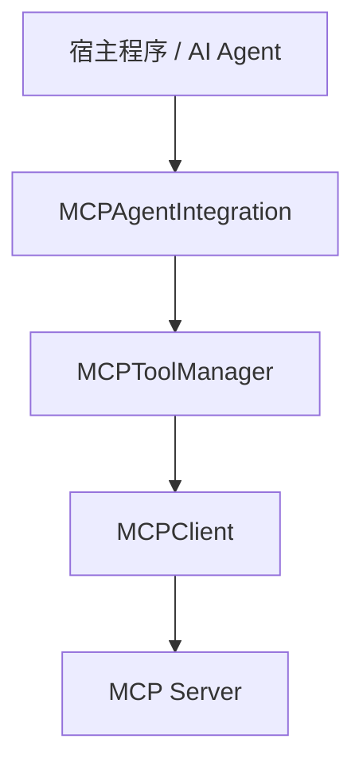
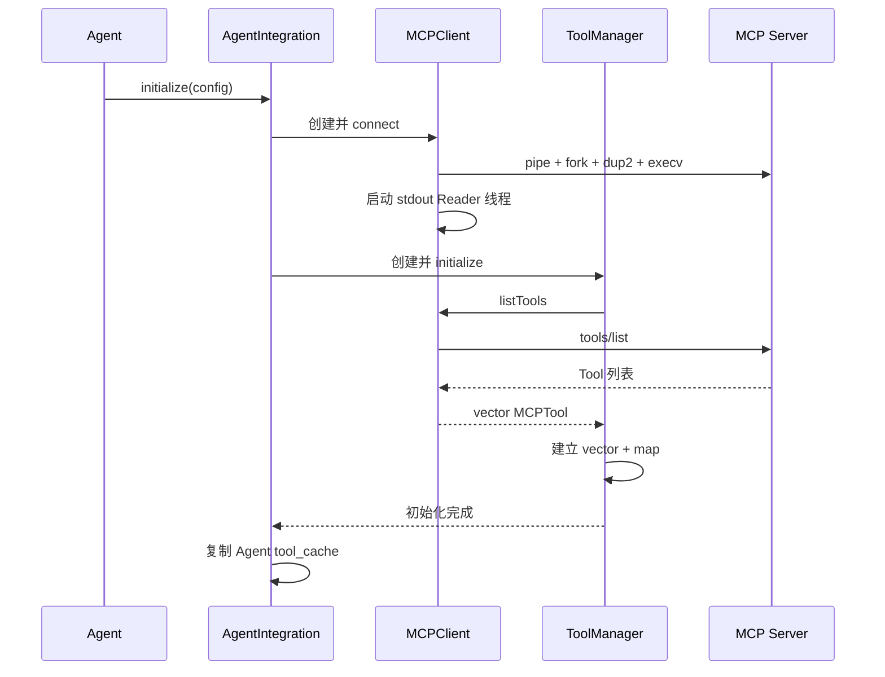
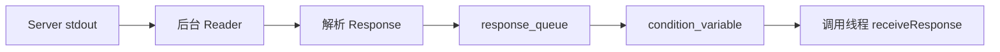

# 第四天：MCP Client

## 学习目标

理解 Client、ToolManager 和 AgentIntegration 的分层，掌握 STDIO 子进程通信、请求响应路径、工具缓存与高层降级行为，并识别当前并发和生命周期边界。

## 一、Client 侧对象分层



### MCPClient

负责协议和通信：

- 启动或连接 MCP Server
- 构造和解析 JSON-RPC
- 发送请求并读取响应
- 管理 STDIO/SSE
- 处理 Response 和 Notification

源码：[mcp_client.cpp](/home/humr/agan-projects/mcp/mcp_client/src/mcp_client.cpp:24)

### MCPToolManager

负责工具目录：

- 调用 `tools/list`
- 缓存 Tool 元数据
- 按名称查询 Tool
- 转发 `tools/call`
- 提供基础参数验证函数

源码：[mcp_tool_manager.cpp](/home/humr/agan-projects/mcp/mcp_client/src/mcp_tool_manager.cpp:10)

### MCPAgentIntegration

负责 Agent 适配：

- 配置和降级
- 连接 Client 与 ToolManager
- 第二层工具缓存
- 结果包装、耗时和有限重试
- 异步接口
- RAG 接入

源码：[mcp_agent_integration.cpp](/home/humr/agan-projects/mcp/mcp_client/src/mcp_agent_integration.cpp:31)

## 二、初始化链



当前 C++ Client 没有执行标准的：

```text
initialize → initialize result → notifications/initialized
```

而是连接后直接执行 `tools/list`。

## 三、STDIO 子进程通信

连接入口：[mcp_client.cpp:33](/home/humr/agan-projects/mcp/mcp_client/src/mcp_client.cpp:33)

子进程启动：[mcp_client.cpp:500](/home/humr/agan-projects/mcp/mcp_client/src/mcp_client.cpp:500)

```text
Client 创建两条匿名管道
  → fork
  → 子进程 dup2 到 stdin/stdout
  → execv MCP Server
  → 父进程保存写入和读取端
```

方向：

```text
Client stdin_pipe_  → Server stdin
Server stdout       → Client stdout_pipe_
```

Client 将 Server stdout 设置成非阻塞并启动后台读取线程。该线程变量名是 `notification_thread_`，但实际同时读取普通 Response 和 Notification。

## 四、请求发送

Tool 调用入口：[mcp_client.cpp:153](/home/humr/agan-projects/mcp/mcp_client/src/mcp_client.cpp:153)

```text
构造 MCPRequest
  → method = tools/call
  → params.name + params.arguments
  → 生成请求 ID
  → buildJSONRPCRequest
  → 追加换行符
  → write 到 Server stdin
```

发送函数：[mcp_client.cpp:392](/home/humr/agan-projects/mcp/mcp_client/src/mcp_client.cpp:392)

当前只调用一次 POSIX `write()`，没有处理部分写入、`EINTR` 和 `EPIPE`。

## 五、后台响应读取

后台读取：[mcp_client.cpp:434](/home/humr/agan-projects/mcp/mcp_client/src/mcp_client.cpp:434)

```text
read stdout_pipe
  → 追加到缓冲字符串
  → 按 \n 截取完整消息
  → parseJSONRPCResponse
  → Response 入队或调用 Notification Callback
```

JSON-RPC 解析：[mcp_client.cpp:596](/home/humr/agan-projects/mcp/mcp_client/src/mcp_client.cpp:596)

Response 入队：[mcp_client.cpp:482](/home/humr/agan-projects/mcp/mcp_client/src/mcp_client.cpp:482)

调用线程等待：[mcp_client.cpp:410](/home/humr/agan-projects/mcp/mcp_client/src/mcp_client.cpp:410)



## 六、请求与响应关联缺陷

虽然 `MCPResponse` 保存了 `id`，`receiveResponse()` 只取共享 FIFO 的队首，没有按 ID 匹配。

这会导致：

- 多个并发调用可能互相拿错 Response
- 响应乱序时发生错误关联
- 一次超时后的迟到 Response 可能污染下一次请求

请求 ID 使用秒级时间戳：[mcp_client.cpp:165](/home/humr/agan-projects/mcp/mcp_client/src/mcp_client.cpp:165)，同一秒内调用可能发生碰撞。

正确模型应当是：

```text
生成唯一 ID
  → 注册 pending_requests[id]
  → 发送请求
  → Reader 根据 response.id 查找对应 pending
  → 只唤醒对应调用线程
```

## 七、Notification 分类问题

当前 STDIO Reader 使用：

```text
id 为空并且 error 非空 → Notification
```

正常 Notification 通常没有 `id`，也没有 `error`，可能被误放入 Response Queue。

合理分类：

```text
存在 method 且没有 id
  → Notification

存在 id 且有 result 或 error
  → Response
```

## 八、MCPToolManager 缓存

刷新入口：[mcp_tool_manager.cpp:187](/home/humr/agan-projects/mcp/mcp_client/src/mcp_tool_manager.cpp:187)

```text
available_tools_ vector
  → 保留完整列表和顺序

tool_map_ map
  → 按名称快速查找
```

同名 Tool 时，vector 保留多个，而 map 后项覆盖前项；Server 却通常执行第一个匹配插件，可能造成 Client 显示的 Schema 和真实执行 Tool 不一致。

同步执行：[mcp_tool_manager.cpp:60](/home/humr/agan-projects/mcp/mcp_client/src/mcp_tool_manager.cpp:60)

它只检查状态和 Tool 存在性，然后转发给 Client。

## 九、参数验证

验证函数：[mcp_tool_manager.cpp:105](/home/humr/agan-projects/mcp/mcp_client/src/mcp_tool_manager.cpp:105)

支持基础：

- required
- string、integer、number、boolean、array、object

但没有完整支持 JSON Schema，也没有被 `executeTool()` 调用。因此属于实现存在、主链未接入的功能。

即使 Client 启用验证，Plugin 仍必须再次验证不可信输入。

## 十、工具刷新与 Notification

ToolManager 通知处理：[mcp_tool_manager.cpp:206](/home/humr/agan-projects/mcp/mcp_client/src/mcp_tool_manager.cpp:206)

它通过字符串搜索 `tools_changed/tools_updated` 决定刷新，而不是解析标准 `notifications/tools/list_changed`。

`MCPServiceIntegrator` 注册了通知回调：[mcp_tool_manager.cpp:239](/home/humr/agan-projects/mcp/mcp_client/src/mcp_tool_manager.cpp:239)

主要入口 `MCPAgentIntegration` 没有注册该回调：[mcp_agent_integration.cpp:263](/home/humr/agan-projects/mcp/mcp_client/src/mcp_agent_integration.cpp:263)

Agent 的 `refreshTools()`：[mcp_agent_integration.cpp:253](/home/humr/agan-projects/mcp/mcp_client/src/mcp_agent_integration.cpp:253)只复制 ToolManager 现有缓存，没有重新请求 Server。

## 十一、AgentIntegration 降级

初始化：[mcp_agent_integration.cpp:31](/home/humr/agan-projects/mcp/mcp_client/src/mcp_agent_integration.cpp:31)

以下情况仍可能返回 `true`：

- MCP 被禁用
- Server 路径为空
- MCP 连接失败

因此：

```text
initialize() == true
  ≠ MCP 可用
```

必须检查：[mcp_agent_integration.cpp:94](/home/humr/agan-projects/mcp/mcp_client/src/mcp_agent_integration.cpp:94)

```cpp
integration.isAvailable();
```

## 十二、重试和超时

同步调用：[mcp_agent_integration.cpp:143](/home/humr/agan-projects/mcp/mcp_client/src/mcp_agent_integration.cpp:143)

重试只覆盖抛出的 C++ 异常，不覆盖普通 `MCPResponse.is_error`、Tool 业务错误或超时返回值。

虽然配置存在 `tool_call_timeout_ms`，STDIO 的等待仍固定为 30 秒：[mcp_client.cpp:414](/home/humr/agan-projects/mcp/mcp_client/src/mcp_client.cpp:414)。配置没有接入真实等待链。

## 十三、异步生命周期风险

ToolManager 异步：[mcp_tool_manager.cpp:79](/home/humr/agan-projects/mcp/mcp_client/src/mcp_tool_manager.cpp:79)

AgentIntegration 异步：[mcp_agent_integration.cpp:210](/home/humr/agan-projects/mcp/mcp_client/src/mcp_agent_integration.cpp:210)

两者均创建捕获裸 `this` 的 detached thread：

```text
异步任务启动
  → 对象 shutdown 或析构
  → Client/Manager/this 被释放
  → 后台线程继续访问
  → use-after-free
```

此外多个异步任务共享同一个不支持 ID 匹配的 Client，可能串错 Response。

## 十四、RAG 接入边界

RAG 初始化：[mcp_agent_integration.cpp:340](/home/humr/agan-projects/mcp/mcp_client/src/mcp_agent_integration.cpp:340)

RAG 失败不会让 MCP 初始化失败。

检索：[mcp_agent_integration.cpp:414](/home/humr/agan-projects/mcp/mcp_client/src/mcp_agent_integration.cpp:414)

```text
RAG 正常
  → 返回 Top-K 相关工具

RAG 未启用、初始化失败或检索异常
  → 返回全部工具
```

Function Calling 转换：[mcp_agent_integration.cpp:442](/home/humr/agan-projects/mcp/mcp_client/src/mcp_agent_integration.cpp:442)

## 十五、阶段结论

当前 Client 最适合：

```text
MCP 作为可选能力
单线程、一次一个请求
失败允许降级
RAG 失败回退全部工具
```

不能直接假定：

- `initialize()` 成功就代表 MCP 可用
- detached 异步调用并发安全
- Response 会按 ID 正确匹配
- 超时配置实际生效
- Tool 参数验证已经接入
- `refreshTools()` 会查询远端 Server
- Notification 会自动更新 Agent 缓存

## 源码索引

- [mcp_client.cpp](/home/humr/agan-projects/mcp/mcp_client/src/mcp_client.cpp:24)
- [mcp_client.h](/home/humr/agan-projects/mcp/mcp_client/include/agent_rpc/mcp/mcp_client.h:105)
- [mcp_tool_manager.cpp](/home/humr/agan-projects/mcp/mcp_client/src/mcp_tool_manager.cpp:10)
- [mcp_agent_integration.cpp](/home/humr/agan-projects/mcp/mcp_client/src/mcp_agent_integration.cpp:31)
- [mcp_agent_integration.h](/home/humr/agan-projects/mcp/mcp_client/include/agent_rpc/mcp/mcp_agent_integration.h:39)

