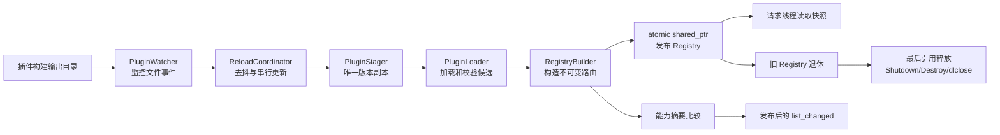
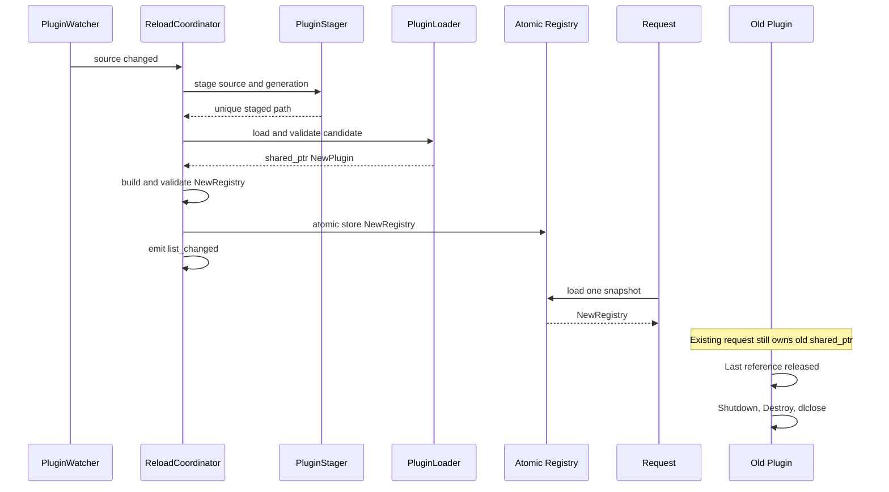

# MCP Server 插件热更新设计与实施计划

## 1. 状态与原则

- 状态：阶段 0 至阶段 6 的实现已完成；TSan 运行仍受当前 WSL 环境限制
- 目标平台：Linux/WSL 优先，保留 Windows/macOS 扩展点
- 标准：C++20
- 原则：按阶段开发；每阶段独立构建、测试和验收；重大设计变化先更新本文

本文是后续热更新实现的执行基线，不直接承诺当前代码已经支持热更新。

## 2. 当前问题

现有实现适合“启动时加载、退出时卸载”：

- `PluginEntry` 保存裸动态库句柄和 `PluginAPI*`：`mcp_server/src/loader/PluginsLoader.h:47`
- `GetPlugins()` 暴露内部 `vector` 引用：`mcp_server/src/loader/PluginsLoader.cpp:166`
- `tools/list` 和 `tools/call` 直接遍历该容器：`mcp_server/src/main.cpp:168`、`:187`
- 卸载立即执行 `Shutdown → DestroyPlugin → dlclose`：`mcp_server/src/loader/PluginsLoader.cpp:145`
- Server 使用 `delete[]` 释放插件结果：`mcp_server/src/main.cpp:207`
- ABI 没有版本、结构大小和插件侧结果释放函数：`mcp_server/src/interface/PluginAPI.h:69`

如果更新线程直接替换容器或卸载动态库，可能导致数据竞争、悬空指针、在途机器代码被卸载、插件后台线程越过 `dlclose`、列表和路由版本不一致。

## 3. 目标与非目标

### 目标

1. 后台发现插件新增、更新和删除。
2. 候选库先复制到唯一 Staging 路径，再加载和校验。
3. 所有检查通过后，一次性发布完整不可变 Registry。
4. 新请求看到新版；在途请求继续安全使用旧版。
5. 最后一个旧引用释放后才 `Shutdown/Destroy/dlclose`。
6. 候选失败时旧版本继续服务。
7. 对外能力变化后发送对应 `list_changed` 通知。
8. 支持手动 Reload、结构化日志和可验证回滚。

### 第一版非目标

- 跨机器插件分发；
- 插件依赖图和多插件分布式事务；
- 自动迁移插件内部状态；
- 强行终止不配合 `Shutdown()` 的插件线程；
- 不兼容 ABI 的运行时自动适配。

## 4. 必须保持的并发不变量

1. **Registry 不可变**：发布后禁止原地修改，更新只能构建并发布新快照。
2. **调用持有强引用**：查找到插件后，直到 `HandleRequest` 返回且结果释放完毕，请求线程始终持有 `shared_ptr<LoadedPlugin>`。
3. **句柄最后释放**：`Shutdown → join 插件线程 → DestroyPlugin → dlclose`。
4. **先验证后发布**：加载、ABI、初始化、Schema、名称冲突和路由构建全部在发布前完成。
5. **失败不改变线上状态**：候选失败只清理候选，不能修改当前 Registry。
6. **单次请求单快照**：一个 Handler 只能读取一次 Registry 快照。
7. **发布先于通知**：先发布新 Registry，再发 `list_changed`。
8. **单写者**：Reload 和 Remove 事务用更新互斥锁串行化；请求读取不占该锁。

## 5. 总体架构



### 模块职责

- `LoadedPlugin`：单个插件版本的 RAII 所有者。
- `PluginRegistry`：不可变插件集合、名称路由和能力摘要。
- `PluginLoader`：把一个 Staging 文件加载成候选对象，不负责发布。
- `PluginStager`：文件稳定性检查、复制、Hash、唯一目录和清理。
- `IPluginWatcher`：只报告文件事件，不执行 `dlopen`。
- `ReloadCoordinator`：完成更新事务、回滚、发布和通知。
- `PluginRuntime`：向 Server 提供快照、手动 Reload、Watcher 启停和状态查询。

## 6. 核心数据结构草案

```cpp
enum class PluginLifecycleState {
    Staging,
    Initializing,
    Active,
    Retired,
    ShuttingDown,
    Unloaded,
    Failed
};

class LoadedPlugin final {
public:
    LoadedPlugin(const LoadedPlugin&) = delete;
    LoadedPlugin& operator=(const LoadedPlugin&) = delete;
    ~LoadedPlugin();

private:
    std::filesystem::path source_path_;
    std::filesystem::path staged_path_;
    LibraryHandle handle_ = nullptr;
    PluginAPI* instance_ = nullptr;
    DestroyPluginFunc destroy_ = nullptr;
    FreePluginResultFunc free_result_ = nullptr;
    std::unique_ptr<PluginHostContext> host_context_;
    PluginMetadata metadata_;
    std::uint64_t generation_ = 0;
};

struct ToolRoute {
    std::shared_ptr<LoadedPlugin> plugin;
    ToolMetadata metadata; // 宿主侧字符串值拷贝
};

struct PluginRegistry {
    std::uint64_t generation = 0;
    std::vector<std::shared_ptr<LoadedPlugin>> plugins;
    std::unordered_map<std::string, ToolRoute> tools;
    std::unordered_map<std::string, PromptRoute> prompts;
    std::unordered_map<std::string, ResourceRoute> resources;
    CapabilityDigest capabilities;
};

class PluginRuntime final {
public:
    bool initialize(const PluginRuntimeConfig& config);
    void shutdown();
    std::shared_ptr<const PluginRegistry> snapshot() const;
    ReloadResult reload(const std::filesystem::path& source_path);
    ReloadResult remove(const std::filesystem::path& source_path);

private:
    std::mutex update_mutex_;
    std::atomic<std::shared_ptr<const PluginRegistry>> registry_;
};
```

只有一个更新事务执行时，`update_mutex_` 比 CAS 重试更清晰；读取路径只做原子 `load()`。

## 7. Plugin ABI v2

热更新前升级 ABI，并同步迁移仓库内六个插件：

```cpp
typedef struct PluginAPI {
    std::uint32_t abi_version;
    std::uint32_t struct_size;
    // 现有接口……
    void (*FreeResult)(char* result);
    PluginHostAPI* host;
} PluginAPI;
```

候选加载必须校验：

- Create/Destroy 符号存在；
- `CreatePlugin()` 返回非空；
- ABI 版本受支持且 `struct_size` 足够；
- 类型、名称、版本和必需函数指针合法；
- `HandleRequest` 与 `FreeResult` 成对存在；
- Tool/Prompt/Resource 数量、索引和 JSON Schema 合法。

结果必须由生成它的插件释放：

```cpp
char* result = plugin.api().HandleRequest(request);
// Server 解析或复制结果
plugin.api().FreeResult(result);
```

Host 通知接口增加 `void* host_context`。旧 Generation 退休后把上下文标记为 inactive，迟到通知直接丢弃。无论如何，`Shutdown()` 返回前插件必须停止并 join 自己的后台线程。

如需兼容外部 ABI v1 插件，可提供只读 Adapter，但 v1 默认禁止热更新。

## 8. Staging 协议

### 目录布局

```text
<runtime-dir>/plugin-staging/
└── <source-id>/
    ├── generation-00000041/
    │   ├── plugin.so
    │   └── metadata.json
    └── generation-00000042/
        ├── plugin.so
        └── metadata.json
```

`metadata.json` 记录源规范路径、SHA-256、大小、mtime、插件名/版本、ABI、Generation、时间和校验结果。

### Staging 步骤

1. 文件事件进入去抖队列。
2. 等待大小和 mtime 稳定，或只接受 `CLOSE_WRITE/MOVED_TO`。
3. 计算 Hash；与当前内容相同则跳过。
4. 复制到新 Generation 临时目录。
5. 校验副本大小和 Hash。
6. 原子 rename 为最终 Generation 目录。
7. 从唯一路径执行 `dlopen(RTLD_NOW | RTLD_LOCAL)`。

不能直接重新 `dlopen` 原路径：构建器可能仍在写文件，且动态加载器可能按相同路径复用旧句柄。

### 保留与清理

- Active 版本不可删除；
- 仍有 `shared_ptr` 的 Retired 版本不可删除；
- 默认保留最近两个成功版本；
- 清理失败只告警，不影响当前 Registry；
- 更新过快导致旧版本堆积时告警，绝不提前 `dlclose`。

## 9. 插件身份与更新语义

第一版以规范化源路径作为部署身份，以 `GetName()` 作为协议身份：

1. 同一源路径的新 Hash 是候选更新。
2. 同一源路径更新后名称改变，拒绝发布。
3. 不同源路径声明相同插件名，拒绝候选。
4. 不同插件暴露相同 Tool/Prompt/Resource 名称，Registry 构建失败。
5. 新源路径表示新增插件。
6. 源文件删除后等待 Grace Period，再原子发布移除版本。
7. 推荐部署方式为“写临时文件后同文件系统原子 rename”。

## 10. 更新与回滚时序



失败时不发布：按已完成阶段逆序执行 `Shutdown（若初始化成功）→ Destroy（若创建成功）→ dlclose（若加载成功）`，记录错误后继续使用旧 Registry。

## 11. Server 路由改造

`main.cpp` 不再遍历 Loader 内部容器。

```cpp
auto registry = plugin_runtime->snapshot();
auto it = registry->tools.find(tool_name);
if (it == registry->tools.end()) {
    return toolNotFound();
}

auto plugin = it->second.plugin;
return invokeAndCopyResult(*plugin, request);
```

`tools/list` 使用同一个快照中的宿主侧元数据值拷贝。Prompt 和 Resource 使用相同模式。这样读路径平均 O(1) 查找，且不会依赖插件内部字符串指针。

## 12. 能力变化通知

Registry 构建时计算稳定摘要：

```text
tools     = hash(name, description, inputSchema)
prompts   = hash(name, description, arguments)
resources = hash(name, description, uri, mime)
```

发布后比较新旧摘要：

- Tool 变化：`notifications/tools/list_changed`
- Prompt 变化：`notifications/prompts/list_changed`
- Resource 变化：`notifications/resources/list_changed`

只改变实现、不改变公开元数据时不通知。通知发送失败不能回滚已发布 Registry，但必须记录告警。

## 13. Watcher 设计

```cpp
struct PluginFileEvent {
    enum class Kind { Created, Modified, Removed, RescanRequired };
    Kind kind;
    std::filesystem::path path;
};

class IPluginWatcher {
public:
    virtual ~IPluginWatcher() = default;
    virtual bool start(EventCallback callback) = 0;
    virtual void stop() = 0;
};
```

Linux 第一版使用 `inotify`：

- 关注 `IN_CLOSE_WRITE`、`IN_MOVED_TO`、`IN_DELETE`、`IN_MOVED_FROM`；
- `IN_Q_OVERFLOW` 转换成 `RescanRequired`；
- Watcher 线程只投递事件，不加载插件；
- `stop()` 必须唤醒阻塞读取并 join；
- 同一路径事件默认去抖 300ms；
- 相同 Hash 不 Reload；
- Rescan 按源路径和 Hash 与 Registry 对账。

## 14. 生命周期与配置

停机顺序：

```text
停止接收新请求
  → 停止并 join Watcher
  → 等待/取消 Reload 事务
  → 停止通知 Writer
  → 发布空 Registry
  → 等待请求释放旧快照
  → LoadedPlugin 自动卸载
  → 销毁 PluginRuntime
```

建议新增参数：

```text
--plugins <source-dir>
--plugin-hot-reload <true|false>
--plugin-staging <runtime-dir>
--plugin-debounce-ms <milliseconds>
--plugin-delete-grace-ms <milliseconds>
--plugin-retain-generations <count>
```

热更新第一版默认关闭；Server 启动时先全量加载，再启动 Watcher。

## 15. 分阶段实施计划

### 阶段 0：基线测试与 ABI 冻结

- [x] 补 Loader 正常、初始化失败和卸载顺序测试
- [x] 记录六个插件的 Tool/Prompt/Resource 基线
- [x] 增加可控阻塞、初始化失败、后台线程、非法 Schema、重复名称测试插件
- [x] 配置 ASan/UBSan/TSan 构建入口
- [x] 冻结 ABI v2 字段与 Shutdown 契约

验收：生命周期顺序可观测；当前功能稳定通过；ABI v2 评审完成。

### 阶段 1：`LoadedPlugin` RAII 与 ABI v2

- [x] 用不可拷贝 `LoadedPlugin` 替换裸 `PluginEntry`
- [x] 封装平台动态库操作和所有失败回滚
- [x] Host 持有通知上下文
- [x] 六个插件迁移到 ABI v2 和 `FreeResult`
- [x] 暂时保持启动加载、退出卸载行为

验收：无功能变化；正常/失败路径无泄漏；Server 不再 `delete[]` 插件结果；动态库只由 RAII 对象卸载。

### 阶段 2：不可变 Registry 与快照路由

- [x] 新增 Registry、Route 和宿主侧元数据拷贝
- [x] 构建 Tool/Prompt/Resource 名称 Map
- [x] 校验重复名称和非法 Schema
- [x] 使用 `shared_ptr` 原子 load/store 发布快照
- [x] 改造全部 Handler 使用单次快照
- [x] 删除 `GetPlugins()` 内部容器暴露

验收：现有结果不变；请求不访问可变 Loader 容器；并发读取无数据竞争；名称查找平均 O(1)。

### 阶段 3：Staging 与手动原子 Reload

- [x] 实现唯一 Staging、Hash 和候选校验
- [x] 实现 `PluginRuntime::reload/remove`
- [x] 实现新 Registry 构建、差异比较和原子发布
- [x] 实现失败保持旧版本
- [x] 增加手动更新和回滚集成测试

验收：阻塞旧请求期间可发布新版；新请求使用新版；旧请求完成前旧库不卸载；坏候选不影响旧版。

### 阶段 4：后台 Watcher

- [x] 定义 `IPluginWatcher`
- [x] 实现 Linux inotify、去抖、Hash 去重和 Rescan
- [x] 支持新增、修改、删除事件
- [x] 集成 Server 生命周期和命令行配置

验收：原子替换 `.so` 自动更新；连续事件只产生一次有效 Reload；Watcher 停止不卡住；溢出后可恢复一致。

### 阶段 5：通知、诊断与 Staging GC

- [x] 实现能力摘要和发布后通知
- [x] 隔离旧 Generation 迟到通知
- [x] 实现 Staging 保留和垃圾回收
- [x] 增加结构化状态与日志

验收：Client 收到通知后读到新列表；无能力变化不通知；在用旧版本不被清理；全流程可按 Generation 追踪。

### 阶段 6：压力测试与发布准备

- [x] 并发请求期间反复更新
- [x] 多插件同时变化
- [x] 初始化失败、Schema 错误、名称冲突
- [x] 后台通知与更新交叉
- [x] Shutdown 与 Reload 竞争
- [x] ASan、UBSan 通过；TSan 构建通过但 WSL 运行时阻断
- [x] 性能基准、插件开发文档和运行手册

验收：无崩溃、死锁、泄漏和数据竞争；失败候选始终保持旧版可用；具备关闭热更新的快速回退开关。

## 16. 关键测试矩阵

| 场景 | 预期 |
| --- | --- |
| 合法新增插件 | 原子新增，列表通知一次 |
| 实现变化、元数据不变 | 新请求使用新版，不发列表通知 |
| Tool Schema 变化 | 原子发布并发 tools/list_changed |
| `dlopen` 或符号失败 | 旧版本继续服务 |
| Create 返回空 | 候选回滚，Server 不崩溃 |
| Initialize 失败 | Destroy + dlclose 候选，旧版不变 |
| 名称冲突或 Schema 非法 | 拒绝候选事务 |
| 旧请求阻塞时更新 | 旧请求完成，新请求使用新版 |
| 连续 v1→v2→v3 | 每个请求只观察一个完整 Generation |
| 删除源文件 | Grace Period 后原子移除并通知 |
| 文件变化但 Hash 相同 | 不 Reload |
| Watcher 事件丢失 | Rescan 恢复一致性 |
| 停机时正在 Reload | 安全等待/取消，无悬空线程 |
| 旧版迟到通知 | inactive Generation 丢弃 |

## 17. 日志要求

每个事务分配 `reload_id`，日志至少包含：

```text
reload_id, source_path, staged_path, plugin_name, plugin_version,
old_generation, candidate_generation, stage, duration_ms, result, error
```

标准阶段：`detected、debounced、staged、library_loaded、instance_created、initialized、metadata_validated、registry_built、published、notification_sent、retired、unloaded、failed`。

默认不得记录完整工具调用参数，避免泄露敏感信息。

## 18. 风险与决策

- 插件不停止后台线程：Server 无法安全强制修复；通过 ABI 契约、测试和诊断约束，不合作插件只能禁用热更新并重启。
- 插件静态全局对象：要求避免不可控全局线程/指针，并用重复 Reload 与 Sanitizer 覆盖。
- 依赖符号冲突：使用 `RTLD_LOCAL`；第一版不支持依赖其他插件全局符号。
- Retired 版本堆积：告警和运维限流，绝不为释放内存提前 `dlclose`。
- ABI v2 破坏兼容：仓库内插件同批迁移；外部 v1 如需兼容，只允许静态加载。

## 19. 完成定义

只有全部满足下列条件，才能称为“安全原子热更新”：

- [x] 候选通过唯一 Staging 文件加载
- [x] 完整校验后才发布
- [x] Registry 以不可变 `shared_ptr` 快照原子替换
- [x] 整个 ABI 调用与结果释放期间持有插件强引用
- [x] 旧插件最后一个引用释放后才卸载
- [x] `Shutdown()` 回收插件全部后台线程
- [x] 更新失败不影响旧版本
- [x] 能力通知发生在发布之后
- [ ] Watcher、Reload、请求和停机竞争已通过自动化与 ASan/UBSan；仍需原生 Linux TSan 验收
- [x] 插件开发和部署文档更新完成

未满足其中任意一项，只能称为动态重新加载实验，不能称为安全热更新。

## 20. 阶段 0 基线结果

### 现有插件能力

| 插件 | 类型 | 对外能力 |
| --- | --- | --- |
| `sleep-tools` | Tool | `sleep` |
| `notification-tools` | Tool | `progress_test`、`logging_test` |
| `weather-tools` | Tool | `get_weather` |
| `calculator-tools` | Tool | `calculator`、`add`、`subtract`、`multiply`、`divide`、`power`、`sqrt`、`factorial` |
| `code-review` | Prompt | `code-review` |
| `bacio-quote` | Resource | `bacio:///quote` |

### 测试夹具

阶段 0 新增：

- 正常生命周期插件；
- Initialize 失败插件；
- 缺少 Create/Destroy 导出符号的动态库；
- Create 返回空实例插件；
- 非法 Schema 插件；
- 两个暴露相同工具名的插件；
- 带后台线程和可控耗时 HandleRequest 的并发插件。

### 已验证命令

```bash
cmake -S . -B build_dev/phase0-debug \
  -DCMAKE_BUILD_TYPE=Debug \
  -DBUILD_TESTING=ON
cmake --build build_dev/phase0-debug -j4
ctest --test-dir build_dev/phase0-debug --output-on-failure
```

结果：`plugins_loader_lifecycle` 通过，正常插件严格执行 `create → initialize → shutdown → destroy`；初始化失败候选执行 `create → initialize → destroy` 且未发布；缺少导出符号的库未发布。

ASan/UBSan 验证：

```bash
cmake -S . -B build_dev/phase0-asan \
  -DCMAKE_BUILD_TYPE=Debug \
  -DBUILD_TESTING=ON \
  -DMCP_ENABLE_ASAN=ON
```

Loader 生命周期测试通过，未报告 Sanitizer 问题。TSan 构建入口已提供为 `MCP_ENABLE_TSAN=ON`，将在并发快照阶段执行。

构建过程中观察到既有 `HttpStreamTransport.cpp` 两个返回 `std::future` 的函数缺少 return 警告；它不属于本阶段改动，暂未修改。

## 21. 阶段 1 实施结果

阶段 1 已完成：

- `PluginAPI` 增加 ABI 版本、结构大小、`FreeResult` 和带上下文的 Host API；
- 六个正式插件和全部测试插件迁移到 ABI v2；
- Server 不再跨动态库执行 `delete[]`，改由插件的 `FreeResult` 释放；
- `LoadedPlugin` 统一持有库句柄、实例、Create/Destroy 函数和 Host API；
- 候选加载使用 `RTLD_NOW | RTLD_LOCAL`；
- 缺少导出、空实例、ABI 不兼容、结构过小和 Initialize 失败均通过同一 RAII 路径回滚；
- Loader 容器改为 `shared_ptr<LoadedPlugin>`，外部强引用可以安全延迟卸载；
- Notification 插件通过 Host API 上下文发送异步消息，不再依赖 Server 为插件裸 `new` 通知对象。

验证目录统一位于：

```text
build_dev/
├── phase0-debug  # 阶段 0 历史产物；搬移后仅归档，不复用 Cache
├── phase0-asan   # 阶段 0 历史产物；搬移后仅归档，不复用 Cache
├── phase1-debug  # 当前有效构建
└── phase1-asan
```

验证结果：

- Phase 1 Debug 全量构建通过；
- CTest 生命周期、失败回滚、空实例、ABI 版本和结构大小测试通过；
- ASan/UBSan 全量构建与 CTest 通过；
- STDIO `initialize → tools/list → calculator` 回归通过，仍发现 12 个工具，`40+2` 返回 42；
- `logging_test` 成功发送 `notifications/message`，随后返回正常工具响应；
- 外部 `shared_ptr` 持有插件时，`PluginsLoader::UnloadPlugins()` 只清空 Loader 所有权，不会提前卸载插件；最后一个强引用释放后才执行 Shutdown/Destroy/dlclose。

## 22. 阶段 2 实施结果

阶段 2 已完成：

- 新增不可变 `PluginRegistry`，按原顺序保存 Tool/Prompt/Resource 列表，同时建立平均 O(1) 的名称或 URI 索引；
- 插件返回的名称、描述、Schema、参数和资源字段均在 staging 构建期间复制到宿主侧；
- Schema/arguments 在发布前解析，空字段、负数 Count、空条目、非法 JSON 和重复路由键会拒绝整个候选 Registry；
- `PluginRegistryStore` 使用标准 `atomic_load_explicit`/`atomic_store_explicit` 操作 `shared_ptr`，兼容当前 GCC/libstdc++ 配置；
- 所有 Server Handler 在入口只读取一次 Registry 快照，调用期间再持有目标插件强引用；
- `PluginsLoader::GetPlugins()` 被替换为返回所有权副本的 `SnapshotPlugins()`，请求路径不再访问 Loader；
- 原 `prompts/get` 遍历第一个条目后提前返回的问题随路由改造一并消除。

验证目录：

```text
build_dev/
├── phase2-debug
├── phase2-asan
└── phase2-tsan
```

验证结果：

- Debug 全量构建通过，Loader 与 Registry 两组 CTest 通过；
- Registry 测试覆盖合法构建、非法 Schema、重复工具名、旧快照持有插件、代际切换以及四读者/一发布者并发压力；
- ASan/UBSan 全量构建和 CTest 通过；
- TSan 全量编译通过，但 WSL 环境在测试进程启动前报 `ThreadSanitizer: unexpected memory mapping`，因此不能把该次运行作为无竞态证明；
- STDIO `initialize → tools/list → tools/call` 回归通过，仍列出 12 个工具，`calculator(20+22)` 返回 42；
- 仍存在与本阶段无关的 `HttpStreamTransport.cpp` 缺少 return 编译警告。

## 23. 阶段 2 完成时确定的后续工作（现已实现）

后续工作是实现唯一 Staging 文件、内容 Hash，以及可手动触发的原子 Reload/Remove 事务。这些内容现已在阶段 3 至阶段 6 中实现。

## 24. 阶段 3 至阶段 6 实施结果

### 阶段 3：原子更新事务

- `PluginRuntime` 以规范化源路径管理部署身份；
- 使用 OpenSSL EVP 计算 SHA-256，相同内容直接跳过；
- 源库复制到唯一临时目录，复核 Hash 后原子 rename，再执行 `dlopen`；
- ABI、Initialize、插件身份、Schema 和全局路由全部通过后才发布 Registry；
- `Reload` 和 `Remove` 由更新互斥锁串行化，失败候选不改变旧 Registry；
- 手动集成测试证明旧快照继续调用 v1，新快照调用 v2。

### 阶段 4：后台监听

- Linux 使用 inotify 递归监听插件目录；
- inotify 线程只生成事件，协调线程负责去抖、Reload 和 Remove；
- 支持关闭写、原子移入、删除事件和队列溢出后的 Rescan；
- 删除使用 Grace Period，事件风暴最终由 SHA-256 去重；
- wake pipe 能唤醒阻塞的 `poll`，Watcher 可确定性停止和 join；
- `--plugin-hot-reload` 默认关闭，可快速回退为仅启动加载。

### 阶段 5：通知、隔离与 GC

- Registry 保存 Tool/Prompt/Resource 的稳定能力表示；
- 发布后比较前后能力，只对真实公开元数据变化发送对应 `list_changed`；
- 每个 `LoadedPlugin` 有独立 Host 通知上下文，退休时标为 inactive；
- 旧快照仍可完成调用，但其迟到异步通知会被丢弃；
- `metadata.json` 记录源路径、SHA-256、大小、mtime、ABI、插件身份和发布 Generation；
- 失败候选立即清理，成功历史按配置保留；仍被旧快照持有的库绝不提前删除；
- Reload 日志包含 `reload_id`、stage、source、staged path 和 Generation。

### 阶段 6：最终验证

- 4 个并发调用线程与 40 次 v1/v2 交替 Reload 通过；
- 两个插件同时 Reload 通过单写者事务串行化并形成完整 Registry；
- Watcher 新增、更新、删除、能力通知和停机均通过真实文件事件测试；
- Shutdown/Reload 竞争最终安全发布空 Registry；
- 10 万次原子快照加工具查询在当前 Debug/WSL 环境约 20ms；
- Debug 与 ASan/UBSan 全量构建、三组 CTest 通过；
- TSan 全量构建通过，但所有测试在进入 `main` 前被 WSL 的 `unexpected memory mapping` 阻断，未获得有效竞态报告；
- STDIO 回归仍列出 12 个工具，`calculator(6*7)` 返回 42。
